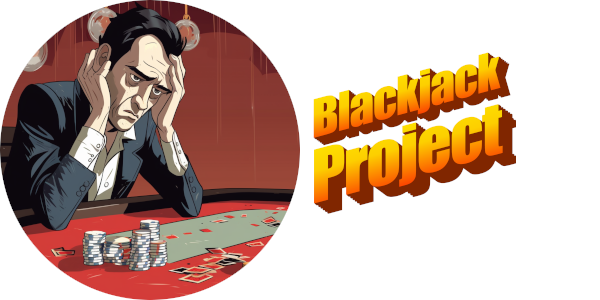

# BlackJackProject

Week 4 homework by Justin Martz

## Description

Running <strong>BJApp</strong> deals a hand of two cards to the user (Player) and the computer (Dealer). The first card in the dealer's hand is face-down. If the user is dealt Blackjack on the first hand, the game ends. If not, the user must then make a choice to "hit" (take another card) or "stand" (allow the dealer to take a turn). If the cards in the user's hand total over 21, the user busts and the dealer wins and the game ends. If not, the dealer takes a turn and decides to hit or stand based on the value of the dealer's hand. The final outcomes based on comparing the two hands are: dealer wins on Blackjack, dealer loses on bust, dealer wins on having a better hand without going over, or player wins with having a better hand.

## Technologies Used

- Java
- Eclipse

## Lessons Learned

To me this was a big lesson of how to use objects within other objects: how to instantiate them, how to access their fields and methods. How do I access Hand or the properties of Hand from the main app if Hand is a protected field of Player, and Hand's fields and methods themselves are protected or private?

To me, the UML described some redundant methods like Deck.size() and Deck.cardsLeftInDeck(). If I'm getting a number of the cards left in the deck, am I not also just getting the current size of the deck? I'm probably missing the point on having both of these methods in Deck but I think I made it work without having to use both.

